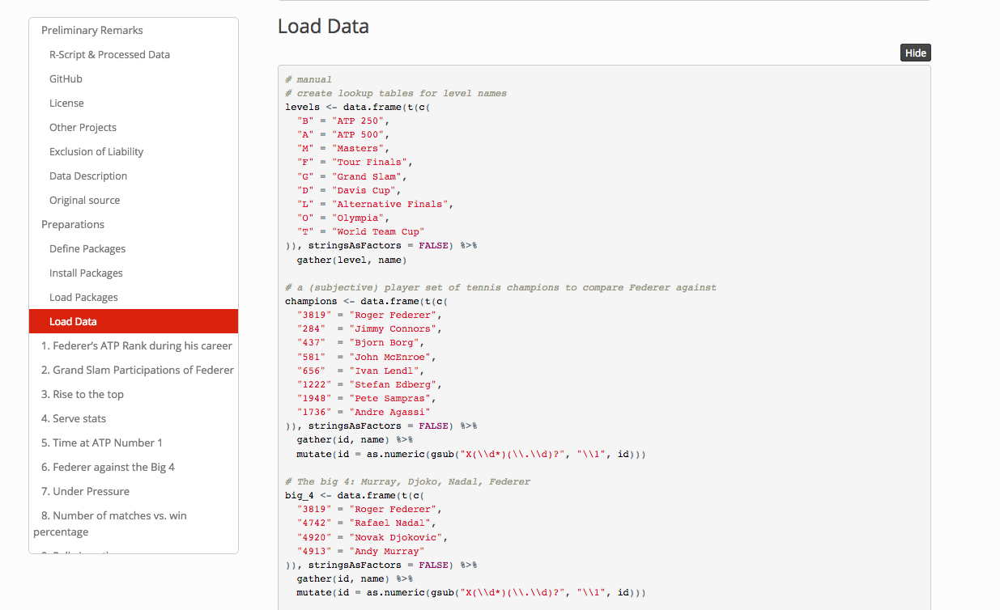
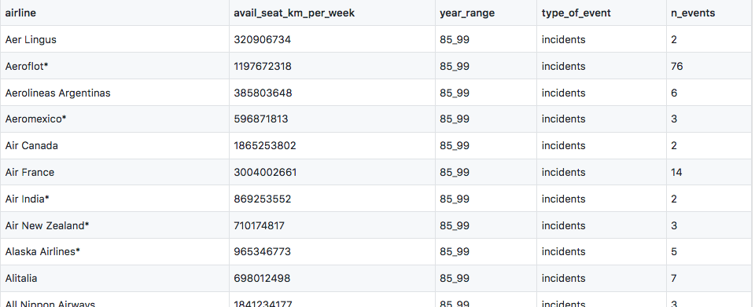
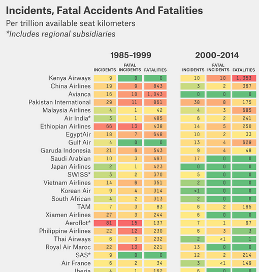

<!-- updated: sys.date())
<!-- From here: https://slides.yihui.name/xaringan/ -->

```{r setup, include=FALSE}
options(htmltools.dir.version = FALSE)
library <- function(...) suppressPackageStartupMessages(base::library(...))
```

---
layout: true


---
class: left, middle

# About me

- Background in Data Analysis / Data Science

- PhD in Life Sciences @ CHUV `r icon::ii_arrow_right_a()` PostDoc @ EPFL (analysis of genetic data)

- `r icon::fa_r_project(colour = "#88398a")`-Ladies Lausanne co-organiser

- `r icon::ii_heart()` Data analysis & Genetic data & Data visualisation

---
class: center, middle, inverse

# What is R?

---
class: left, middle

# R ...

- is "a programming language for statistical computing"

- is free

- has a webpage: https://www.r-project.org/

- just celebrated its [25 year anniversary](https://rss.onlinelibrary.wiley.com/doi/10.1111/j.1740-9713.2018.01169.x)

- comes with *basic*/*default* packages, but there are over 13'000 R-packages `r emo::ji("open_mouth")` that can be installed through [CRAN](https://cran.r-project.org/web/packages/) or repositories like github


---
class: center, middle

# Typical data analysis workflow


## `r emo::ji("thinking")` `r icon::fa_arrow_right(colour = "gray")` `r icon::fa_table(colour = "black")` `r icon::fa_arrow_right(color = "gray")` `r icon::fa_laptop(colour = "#377eb8")` `r icon::fa_arrows_alt(color = "gray")` `r icon::fa_r_project(colour = "#377eb8")` `r icon::fa_arrow_right(colour = "gray")` `r icon::fa_chart_line(color = "#f03b20")` `r icon::fa_arrow_right(colour = "gray")` `r icon::fa_lightbulb(color = "#31a354")` `r icon::fa_arrow_right(colour = "gray")` `r icon::fa_map_signs(color = "#d95f0e")`
<!--- question > getting data > analysing / distill knowledge > do soemthing with that -->

`Question > Data > Analyse data with a tool > Distill knowlege from data > Feel enlightened :-) > Take decisions`

---
class: inverse, center, middle

# What is R used for?

---
class: middle

# Quite a few things

- In general lots of (but not all) data science, data analysis & stats stuff

- Me: genomics, biostatistics

- To make presentations (this one)

---

## Basic R 

### Math operations
```{r}
1+1 ## basic math operations
```

### Important constants
```{r}
pi 
```


---

## Basic R 

### Vector, matrices
```{r}
a <- c(34, 1, 67) ## defining a vector
mat <- matrix(1:6, ncol = 2) ## defining a matrix
class(a)
class(mat)
```

---

## Basic R 
### Object oriented
```{r}
summary(a)
summary(mat)
```


---

## Basic R 

### Asking for help
```{r}
?data.frame
```

### Making a plot
```{r, fig.width = 3, fig.height= 3}
plot(rnorm(100)) ## plot 100 numbers that were drawn randomly from a normal distribution
```


---

## Statistical analyses

### 1. Load libraries
```{r}
## install packages (only run this once)
## install.packages("readr")
## install.packages("dplyr")
## install.packages("skimr")
## install.packages("ggplot2")

library(readr) ## for read_csv()
library(dplyr) ## for rename()
library(skimr) ## for skim()
library(ggplot2) ## for visualisations
theme_set(theme_bw())
```
---

### 2. Import data
```{r, warning = FALSE, message = FALSE}
dat <- read_csv("https://vincentarelbundock.github.io/Rdatasets/csv/datasets/swiss.csv")
# use library(readxl) for xls data!
# swiss is actually an R package dataset of library(datasets), but has the column X1 as rownames
?swiss
dat
```
---


### 3. Summarise data
```{r}

## summary
skim(dat %>% select(X1, Fertility, Education, Catholic))
```
---


### 4. Rename a column
```{r}

## colum to rownames + binary catholic (> 50%)
dat <- dat %>% rename(Region = X1) %>% mutate(Catholic.bin = Catholic > 50)
dat
```

```{r, eval = FALSE, echo = FALSE}
## visualise data
pairs(swiss, panel = panel.smooth, main = "swiss data", col = 3 + (swiss$Catholic > 50))
```
---

### 5. Visualise data
```{r, data-vis, fig.width = 7, fig.height = 6}
ggplot(data = dat) + geom_point(aes(Education, Fertility, color = Catholic))

```
---

### 7. Fit model
```{r}

mod <- lm(Fertility ~ Education + Catholic.bin, data = dat)
summary(mod)
```
---

### 7. Linear regression on plot
```{r, data-vis-mod, fig.width = 7, fig.height = 6}
ggplot(data = dat, aes(Education, Fertility, color = Catholic.bin, group = Catholic.bin)) + geom_point() + geom_smooth(method = "lm")

```


---

## Data journalism

<a href="https://www.srf.ch/static/srf-data/data/2018/federer/#/en">

</a>


[Source: SRF](https://www.srf.ch/static/srf-data/data/2018/federer/#/en)

---

## Data journalism

<a href="https://srfdata.github.io/2018-01-roger-federer/#load_data">

</a>

[Source: SRF](https://srfdata.github.io/2018-01-roger-federer/)

---

## Memes and GIFs

<a href="http://djnavarro.net/post/2018-05-03-valid-social-commentary/">

</a>

[Source: Danielle Navaro](http://djnavarro.net/post/2018-05-03-valid-social-commentary/)

---

## Memes and GIFs

```{r, meme1, echo = TRUE}
## install.packages("glue") ## run this once
## install.packages("meme") ## run this once

library(meme) ## tell R that the meme package is needed
library(glue) ## tell R that the glue package is needed

loc <- "https://djnavarro.net/img/meme/"
```

```{r, meme1b, eval = FALSE}

meme(
  img = glue(loc,"morpheus.png"),
  upper = "what if i told you",
  lower = "i made this in R",
  size = 1
)

```

[Source: Danielle Navaro](http://djnavarro.net/post/2018-05-03-valid-social-commentary/)

---

## Memes and GIFs

```{r, meme2, fig.width = 4}

meme(
  img = "img/cat.jpeg",
  upper = "I have no time to be impressed",
  lower = "MMMkay", 
  size = 1
)

```


---

## Animations

<blockquote class="twitter-tweet" data-cards="hidden" data-lang="en"><p lang="en" dir="ltr">Getting ready to teach dplyr joins to new <a href="https://twitter.com/hashtag/rstats?src=hash&amp;ref_src=twsrc%5Etfw">#rstats</a> users tomorrow, so naturally I productively procrastinated by getting to know the new gganimate. It is the coolest! <a href="https://t.co/1kkOi5D5TK">pic.twitter.com/1kkOi5D5TK</a></p>&mdash; Garrick Aden-Buie (@grrrck) <a href="https://twitter.com/grrrck/status/1029567123029467136?ref_src=twsrc%5Etfw">August 15, 2018</a></blockquote>
<script async src="https://platform.twitter.com/widgets.js" charset="utf-8"></script>


---

## Animations

<a href="https://raw.githubusercontent.com/gadenbuie/tidy-animated-verbs/master/images/anti-join.gif">

</a>

[Source: Github](https://github.com/gadenbuie/tidy-animated-verbs#tidy-animated-verbs)

---

## Decision making for lunch

<blockquote class="twitter-tweet" data-lang="en"><p lang="en" dir="ltr">Just learned, courtesy of <a href="https://twitter.com/AdamGruer?ref_src=twsrc%5Etfw">@AdamGruer</a>, that there is an <a href="https://twitter.com/hashtag/rstats?src=hash&amp;ref_src=twsrc%5Etfw">#rstats</a> compiler app on iOS. What people may not know is that for years I have been using &#39;sample&#39; function in R to make decisions for difficult choices. Now I have it handy in my mobile!<br> <a href="https://t.co/vQxVNhjchm">https://t.co/vQxVNhjchm</a> <a href="https://t.co/rCPubC6BeD">pic.twitter.com/rCPubC6BeD</a></p>&mdash; Emi Tanaka 🌾 (@statsgen) <a href="https://twitter.com/statsgen/status/1027332304656465920?ref_src=twsrc%5Etfw">August 8, 2018</a></blockquote>
<script async src="https://platform.twitter.com/widgets.js" charset="utf-8"></script>


---
class: inverse, center, middle

# How can I use it?
---

class: left, middle
## Getting started

1. **Install** R :
  - On a computer: via [RStudio](https://www.rstudio.com/products/rstudio/download/) or [R project](https://stat.ethz.ch/CRAN/).

  - Or (easier) use R in browser: [rdrr.io/snippets/](https://rdrr.io/snippets/) (no login required) or [Studio Cloud](https://rstudio.cloud/) (login with google or githu baccount).

--

1. `r emo::ji("interrobang")` Come up with a **question** you want to answer. 
--

1. Get your hands on **data** `r emo::ji("twisted_rightwards_arrows")` Take part in [TidyTuesday](https://github.com/rfordatascience/tidytuesday). 


```{r, eval = FALSE, echo = FALSE}
## install.packages("fivethirtyeight") ## run this once
## install.packages("tidyverse") ## run this once
library(fivethirtyeight) ## tell R that we will need the functions + datasets from the 538 R package
library(tidyverse) ## thats another package bundle that we will need
airline_safety ## this is the dataset we want
?airline_safety

## number of rows
nrow(airline_safety)

names(airline_safety)

ggplot(data = airline_safety) + geom_histogram(aes(x = avail_seat_km_per_week))

## wide to long
airline_safety %>% gather(key = c(airline, incl))

```


---
class: inverse, center, middle

# R Community

---
class: center, middle

## `r icon::fa_rocket(colour = "black")` R is developing quickly `r icon::fa_rocket(colour = "black")`

## `r icon::fa_users(colour = "black")` R community can help you learn!

---
class: left, middle

## [RWeekly](https://rweekly.org/) Newsletter `r icon::fa_dove (colour = "black")` `r icon::fa_envelope (colour = "black")`

- Submit & subscribe here: https://rweekly.org/

- Weekly selection of **blogs** delivered into your mailbox.

- Replicating code is a good way to learn!

---
class: left, middle

## [TidyTuesday](https://github.com/rfordatascience/tidytuesday)

TidyTuesday provides you weekly with a new dataset (and a goal).

<blockquote class="twitter-tweet" data-lang="en"><p lang="en" dir="ltr">The <a href="https://twitter.com/R4DScommunity?ref_src=twsrc%5Etfw">@R4DScommunity</a> welcomes you to week 19 of <a href="https://twitter.com/hashtag/tidytuesday?src=hash&amp;ref_src=twsrc%5Etfw">#tidytuesday</a>!  We&#39;re exploring <a href="https://twitter.com/FiveThirtyEight?ref_src=twsrc%5Etfw">@FiveThirtyEight</a> data on airline safety! Many thanks to 538 package maintainers!<br><br>Data: <a href="https://t.co/sElb4fcv3u">https://t.co/sElb4fcv3u</a>       <br>Article: <a href="https://t.co/qmm69g8khc">https://t.co/qmm69g8khc</a>   <a href="https://twitter.com/hashtag/r4ds?src=hash&amp;ref_src=twsrc%5Etfw">#r4ds</a> <a href="https://twitter.com/hashtag/tidyverse?src=hash&amp;ref_src=twsrc%5Etfw">#tidyverse</a> <a href="https://twitter.com/hashtag/rstats?src=hash&amp;ref_src=twsrc%5Etfw">#rstats</a> <a href="https://twitter.com/hashtag/dataviz?src=hash&amp;ref_src=twsrc%5Etfw">#dataviz</a> <a href="https://t.co/wl5UZCojEP">pic.twitter.com/wl5UZCojEP</a></p>&mdash; Thomas @ Strata Data NY - RStudio Booth (@thomas_mock) <a href="https://twitter.com/thomas_mock/status/1026505945722101760?ref_src=twsrc%5Etfw">August 6, 2018</a></blockquote>
<script async src="https://platform.twitter.com/widgets.js" charset="utf-8"></script>

---
class: left, middle

## TidyTuesday

.pull-left[
### Dataset

<a href="https://github.com/rfordatascience/tidytuesday/blob/master/data/2018-08-07/week19_airline_safety.csv">

</a>
]

.pull-right[

### Goal (if you need one)
<a href="https://fivethirtyeight.com/features/should-travelers-avoid-flying-airlines-that-have-had-crashes-in-the-past/">

</a>

]

---
class: left, middle

## `r icon::fa_r_project(colour = "#88398a")`-Ladies


- **Global** organisation.

- **Mission**: *To increase gender diversity in the R community* by encouraging, inspiring, and empowering underrepresented minorities.

- Founded in 2012 by [**Gabriela de Queiroz**](https://rladies.org/united-states-rladies/name/gabriela-de-queiroz/).

- Currently **125 R-Ladies meetup groups** in 40 countries.

---
class: center, middle


.footnote[[Source code](https://github.com/rladies/Map-RLadies-Growing) by [Daniela Vázquez](https://twitter.com/d4tagirl).]

---
class: left, middle


- Find our more about **R-Ladies**: https://rladies.org/

- Find other **chapters**: https://gqueiroz.shinyapps.io/rshinylady/

- Find **speakers**: https://rladies.org/directory/


---
class: left, middle

## R user groups nearby `r icon::fa_users(colour = "black")`

- R-Ladies chapter in Lausanne: https://www.meetup.com/rladies-lausanne/

- Geneve R user group: https://www.meetup.com/Geneve-R-User-Group/

- R Lunches in Geneve: http://use-r-carlvogt.github.io/prochains-lunchs/

- adminR in Bern: https://www.meetup.com/adminR/

- Check out global list [here](https://jumpingrivers.github.io/meetingsR/) (provided by jumping rivers)


---
class: left, middle

## Keeping up on the road: Podcasts `r icon::fa_headphones(colour = "black")`


- [Not So Standard Deviations](https://soundcloud.com/nssd-podcast) by Hilary Parker and Roger Peng.

- [Credibly Curious](https://soundcloud.com/crediblycurious) by Saskia Freytag and Nicholas Tierney. 


---
class: inverse, center, middle

# Thank you!

Slides: [https://sinarueeger.github.io/20180912-geek-girls-carrots/slides#1](https://sinarueeger.github.io/20180912-geek-girls-carrots/slides#1)

`r icon::fa_twitter(colour = "white")`: [@sinarueeger](https://twitter.com/sinarueeger)
